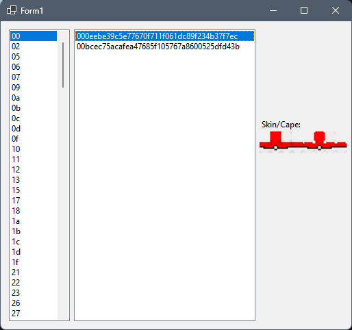

# Minecraft Launcher Skins

## Description
Allows for a simple click-and-view interface to see the images in the files that have been stripped of their extensions. 
- Left list box is for selecting the folder containing the images
- Right list box is for selecting the images inside the folder selected in the left list box
What it **should** look like: 

## Download
[Minecraft Launcher Skins (exe)](https://github.com/Lexz-08/Minecraft-Launcher-Skins/releases/download/mls-release/Minecraft.Launcher.Skins.exe)
